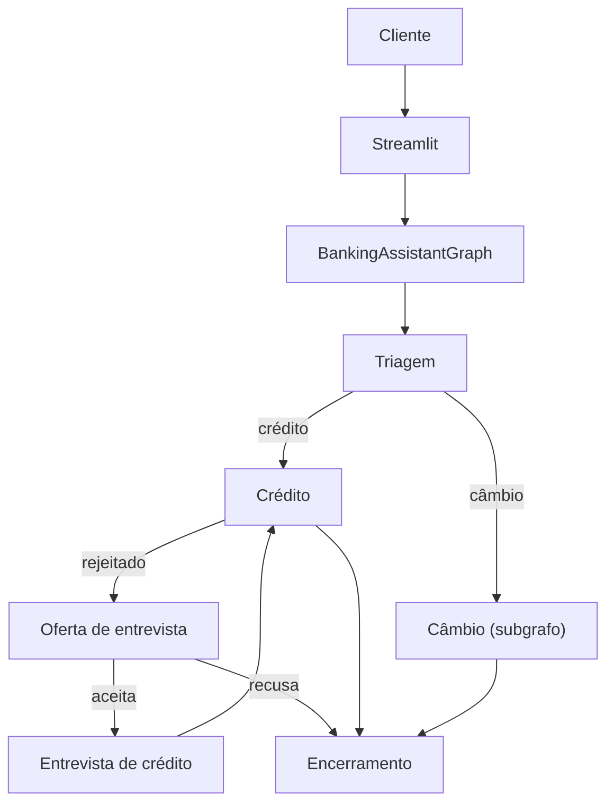

# Design: Banking Assistant

## Decisão Arquitetural

A solução usa um único `BankingAssistantGraph` em LangGraph. Os agentes do enunciado são modelados como capacidades internas do grafo, preservando uma experiência contínua para o cliente. O câmbio é estruturado como um subgrafo composto, exercitando *tool-calling* e *subgraph composition*.

## Componentes

- `app.py`: UI em Streamlit.
- `src/graph.py`: montagem do `StateGraph`, nós e rotas.
- `src/exchange_subgraph.py`: subgrafo de câmbio (`extrai_moeda → busca_cotacao`) com tool-calling e tradução para pt-BR.
- `src/state.py`: estado compartilhado do atendimento.
- `src/llm.py`: configuração do DeepSeek via OpenRouter e o gate `optional_chat_model`.
- `src/observability.py`: tracing sanitizado para LangSmith.
- `src/conversation.py`: respostas humanizadas e normalização de texto para a UI.
- `src/tools/auth.py`: autenticação via CSV.
- `src/tools/credit.py`: limite, solicitação e decisão de aumento.
- `src/tools/scoring.py`: cálculo e atualização de score.
- `src/tools/exchange.py`: consulta de câmbio via Tavily e a *function tool* `consultar_cotacao`.
- `src/schemas.py`: modelos estruturados para intenção e entrevista.
- `evals/run_intent_eval.py`: runner de avaliação offline de intenção no LangSmith.
- `evals/datasets/intent_cases.jsonl`: dataset pequeno de casos de intenção.

## Fluxo

## Regras

- O LLM é o caminho principal para classificação de intenção depois da autenticação.
- A classificação de intenção pede JSON válido ao LLM e valida a resposta localmente com `IntentResult`, contendo `intent` e `confidence`.
- O fallback por palavras-chave existe apenas para execução local sem `OPENROUTER_API_KEY` ou falha técnica do provedor.
- Se o LLM retornar `unknown`, essa decisão é preservada; o grafo deve pedir esclarecimento em vez de forçar uma rota por heurística.
- O LLM também pode apoiar respostas conversacionais, mas não decide regras bancárias.
- Respostas conversacionais geradas por LLM são normalizadas para texto simples antes de serem renderizadas no Streamlit.
- Python executa regras auditáveis: autenticação, score, limite, CSV e API externa.
- Tavily fica encapsulado em `src/tools/exchange.py`, permitindo teste com cliente falso.
- OpenRouter fica encapsulado em `src/llm.py`, permitindo troca de modelo via `.env`.
- `src/llm.py` reutiliza o client LLM em cache por modelo e temperatura para reduzir latência.
- LangSmith registra observabilidade leve de turnos do atendimento com metadados sanitizados.
- Evals no LangSmith focam na triagem *agentic*; regras determinísticas continuam validadas por `pytest`.

## Triagem Agentic

O nó `triage` chama `classify_intent()`. Essa função tenta primeiro obter um modelo em runtime via `src/llm.py`. Quando disponível, o modelo recebe um prompt de domínio do Banco Ágil e retorna um JSON estruturado com uma das intenções válidas:

- `credit`
- `credit_interview`
- `exchange`
- `end`
- `unknown`

Esse desenho evita depender apenas de palavras-chave. Por exemplo, uma frase como "queria melhorar meu poder de compra no cartão" deve ser interpretada pelo LLM como `credit`, mesmo sem conter literalmente "limite" ou "crédito".

O parsing do JSON é feito pela aplicação com Pydantic. Essa escolha preserva saída estruturada e evita warnings de serialização no LangSmith causados por objetos Pydantic acoplados diretamente ao retorno bruto do provedor.

## Subgrafo de Câmbio (tool-calling)

O câmbio é um subgrafo dedicado em `src/exchange_subgraph.py`, composto por dois nós:

- `extrai_moeda`: vincula a tool `consultar_cotacao` ao modelo com `bind_tools`. O LLM emite um `tool_call` informando a moeda em código ISO de três letras. Sem LLM (ou sem `tool_calls`), há fallback determinístico por palavras-chave/regex que cobre as moedas mais comuns.
- `busca_cotacao`: executa a tool `consultar_cotacao` (que envolve a Tavily) sob `try/except`, e traduz a resposta para pt-BR a temperatura 0, preservando os valores numéricos.

Esse arranjo demonstra tool-calling nativo sem abrir mão do determinismo: o LLM decide qual moeda; o Python decide como buscar e trata os erros.

## Observabilidade e Evals

O tracing usa `LANGSMITH_TRACING`, `LANGSMITH_API_KEY`, `LANGSMITH_ENDPOINT` e `LANGSMITH_PROJECT`. A UI registra um resumo sanitizado de cada turno, incluindo rota, intenção e estado de autenticação, sem expor CPF completo.

A avaliação offline usa um dataset pequeno de classificação de intenção. O target chama `classify_intent()` e o evaluator `intent_accuracy` compara a intenção prevista com a esperada. Isso demonstra domínio de evals sem aumentar a complexidade do desafio.

## Memória de Fluxo

O estado guarda `active_flow` para manter a conversa no trilho sem reclassificar a intenção a cada turno. Valores:

- `credit_increase`: aguardando o valor de aumento; continuações como "vamos lá" ou "uns 5k" seguem para o crédito.
- `credit_interview_offer`: aguardando o sim/não do cliente sobre fazer a entrevista.
- `credit_interview`: entrevista em andamento, coletando os campos um a um.

A triagem dá prioridade ao `active_flow` (exceto quando o cliente pede para encerrar), e a extração de valores/campos é feita pelo LLM com fallback determinístico.

## Fluxo de Crédito

Dentro do domínio `credit`, o grafo diferencia consulta de limite e aumento de limite. O valor desejado é extraído pelo LLM (`extract_requested_limit`) e validado por `LimitIncreaseRequest`. A submissão do aumento exige intenção de aumento no turno atual, evitando registrar uma solicitação duplicada em uma simples consulta.

Quando o aumento é rejeitado (ou quando o score não permite aumento), o crédito oferece a entrevista e aguarda o consentimento. Se o cliente aceitar, a entrevista conduz a coleta passo a passo, valida com `CreditInterviewAnswers`, recalcula o score deterministicamente e volta para nova análise.
