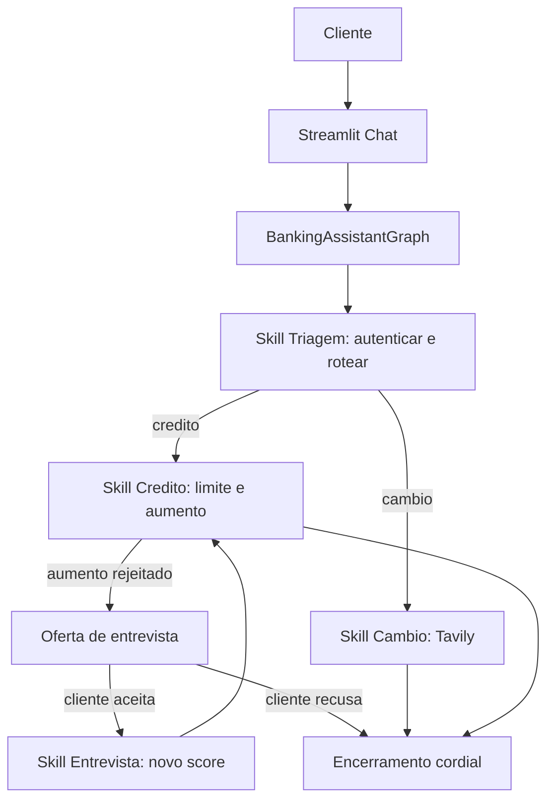

# Desafio Agentes IA Banco Agil

[](https://www.python.org/)
[](https://www.langchain.com/langgraph)
[](https://www.langchain.com/langsmith)
[](https://streamlit.io/)
[](#tutorial-de-execucao-e-testes)

**Tags:** `langgraph` `langsmith` `openrouter` `deepseek` `streamlit` `tavily` `ai-agents` `sdd` `evals`

> Enunciado original: [`docs/challenge/desafio-tecnico-agentes-ia-bianca.pdf`](docs/challenge/desafio-tecnico-agentes-ia-bianca.pdf)

## Sumario

- [Visao Geral](#visao-geral)
- [Arquitetura do Sistema](#arquitetura-do-sistema)
- [Funcionalidades Implementadas](#funcionalidades-implementadas)
- [Observabilidade e Evals](#observabilidade-e-evals)
- [Estrutura do Projeto](#estrutura-do-projeto)
- [Desafios Enfrentados e Como Foram Resolvidos](#desafios-enfrentados-e-como-foram-resolvidos)
- [Escolhas Tecnicas e Justificativas](#escolhas-tecnicas-e-justificativas)
- [Tutorial de Execucao e Testes](#tutorial-de-execucao-e-testes)

## Visao Geral

Atendimento bancario inteligente para o Banco Agil, um banco digital ficticio. O desafio descreve quatro agentes especializados, mas tambem exige que as transicoes sejam implicitas, de modo que o cliente sinta que fala com um unico atendente.

Por isso a solucao usa um unico `BankingAssistantGraph` em LangGraph, no qual cada "agente" do enunciado vira uma skill (no) interna do grafo. O LLM (DeepSeek via OpenRouter) entende a linguagem natural e transcreve para dados estruturados; o Python aplica as regras bancarias deterministicas e auditaveis.

## Arquitetura do Sistema

### Agentes do enunciado como skills

| Agente do desafio | Skill no grafo | Responsabilidade |
| --- | --- | --- |
| Triagem | `triage_node` | Saudacao, coleta e validacao de CPF/data, ate 3 tentativas, roteamento por intencao |
| Credito | `credit_node` | Consulta de limite, solicitacao de aumento, registro em CSV e decisao por score |
| Entrevista de Credito | `credit_interview_node` | Entrevista passo a passo, calculo do novo score e atualizacao do cadastro |
| Cambio | `exchange_node` | Cotacao em tempo real via Tavily e encerramento cordial |

### Fluxo



### Camada de entendimento (LLM) versus regras (Python)

- O LLM classifica a intencao e extrai dados estruturados (valor de aumento, respostas da entrevista, consentimento) validados por modelos Pydantic em [src/schemas.py](src/schemas.py).
- Quando nao ha `OPENROUTER_API_KEY` ou ocorre falha tecnica, ha um fallback deterministico, mantendo o sistema testavel offline.
- As decisoes bancarias (autenticacao, score, aprovacao de limite, escrita em CSV) sao 100% Python, auditaveis.

### Manipulacao de dados

- [data/clientes.csv](data/clientes.csv): base de clientes (CPF, nome, nascimento, limite, score).
- [data/score_limite.csv](data/score_limite.csv): faixa de score para limite maximo permitido.
- [data/solicitacoes_aumento_limite.csv](data/solicitacoes_aumento_limite.csv): registro formal das solicitacoes com `cpf_cliente`, `data_hora_solicitacao` (ISO 8601), `limite_atual`, `novo_limite_solicitado`, `status_pedido`.

## Funcionalidades Implementadas

- Saudacao inicial humanizada e coleta de CPF e data de nascimento.
- Autenticacao contra `clientes.csv`, aceitando data em ISO (`AAAA-MM-DD`) e brasileiro (`DD/MM/AAAA` ou `DD-MM-AAAA`).
- Ate tres tentativas de autenticacao e encerramento cordial apos a terceira falha.
- Triagem de intencao apos a autenticacao, conduzida pelo LLM com saida estruturada.
- Consulta de limite de credito.
- Solicitacao de aumento com extracao do valor pelo LLM ("cinco mil", "5k", "8 mil") e registro em CSV.
- Aprovacao ou rejeicao por score via `score_limite.csv`.
- Oferta de entrevista de credito quando o aumento e rejeitado, conduzida apenas se o cliente aceitar.
- Entrevista passo a passo (renda, emprego, despesas, dependentes, dividas) com calculo de novo score (0 a 1000) e atualizacao do cadastro.
- Consulta de cambio em tempo real via Tavily, com encerramento amigavel.
- Encerramento do atendimento a qualquer momento.
- Tratamento de erros controlado (CSV ausente, API indisponivel, entrada invalida) com log tecnico.
- Memoria de fluxo para continuar follow-ups sem reclassificar do zero.
- UI em Streamlit, observabilidade e eval offline com LangSmith.

## Observabilidade e Evals

LangSmith e usado de forma enxuta, focado no que mais importa para um sistema agentic:

- [src/observability.py](src/observability.py) registra um resumo sanitizado de cada turno; CPFs sao mascarados antes de ir para o trace.
- [evals/datasets/intent_cases.jsonl](evals/datasets/intent_cases.jsonl) contem casos de classificacao de intencao.
- [evals/run_intent_eval.py](evals/run_intent_eval.py) cria/reusa o dataset no LangSmith e roda a metrica `intent_accuracy`.

## Estrutura do Projeto

```text
.
├── app.py
├── data/
│   ├── clientes.csv
│   ├── score_limite.csv
│   └── solicitacoes_aumento_limite.csv
├── docs/
│   └── challenge/
│       └── desafio-tecnico-agentes-ia-bianca.pdf
├── evals/
│   ├── datasets/
│   │   └── intent_cases.jsonl
│   └── run_intent_eval.py
├── src/
│   ├── graph.py
│   ├── llm.py
│   ├── conversation.py
│   ├── observability.py
│   ├── schemas.py
│   ├── state.py
│   └── tools/
│       ├── auth.py
│       ├── credit.py
│       ├── exchange.py
│       └── scoring.py
├── tests/
└── .specs/
```

## Desafios Enfrentados e Como Foram Resolvidos

- **Transicao implicita entre agentes:** o desafio pede agentes especializados, mas sem que o cliente perceba a troca. Resolvido modelando os agentes como skills de um unico grafo LangGraph, com estado compartilhado.
- **Entendimento de linguagem natural:** valores como "cinco mil" nao eram capturados por regex, e a entrevista travava. Passamos a extracao para o LLM com schemas Pydantic, deixando o regex apenas como fallback.
- **Memoria de atendimento:** o agente reclassificava a intencao a cada turno e perdia o contexto. Adicionamos um estado de fluxo ativo (`active_flow`) que mantem a conversa no trilho (aumento, oferta de entrevista, entrevista) ate concluir ou o cliente encerrar.
- **Consentimento da entrevista:** ajustamos para oferecer a entrevista quando o aumento e rejeitado e so conduzir se o cliente aceitar, como o enunciado exige.
- **Renderizacao no Streamlit:** o `R$` quebrava a tela porque o `$` era interpretado como formula LaTeX. Passamos a escapar o cifrao em todas as mensagens exibidas.
- **Decisoes auditaveis:** mantivemos score, aprovacao e CSV em Python deterministico, sem delegar regra de negocio ao LLM.

## Escolhas Tecnicas e Justificativas

- **LangGraph**: orquestra o atendimento como grafo de estados, com rotas explicitas e transicao implicita entre skills.
- **OpenRouter + DeepSeek**: LLM como camada de entendimento e extracao estruturada (JSON validado por Pydantic), configuravel por `.env`.
- **Pydantic schemas**: `IntentResult`, `LimitIncreaseRequest` e `CreditInterviewAnswers` garantem que a saida do LLM vire dado confiavel.
- **Memoria de fluxo (`active_flow`)**: preserva o contexto imediato do atendimento para continuar follow-ups sem depender so da ultima frase.
- **Cache do client LLM**: reutiliza o client por modelo e temperatura para reduzir latencia.
- **Tavily**: cotacoes de moedas em tempo real.
- **LangSmith**: tracing e eval offline sem MLOps pesado.
- **CSV**: persistencia simples e auditavel, aderente ao enunciado.
- **SDD + TDD**: requisitos, design e tarefas em [.specs/](.specs/) e suite de testes guiando a implementacao.

## Tutorial de Execucao e Testes

Crie um arquivo `.env` baseado em [.env.example](.env.example):

```bash
OPENROUTER_API_KEY=sua_key_openrouter
OPENROUTER_MODEL=deepseek/deepseek-v4-flash
TAVILY_API_KEY=sua_key_tavily
LANGSMITH_TRACING=true
LANGSMITH_ENDPOINT=https://api.smith.langchain.com
LANGSMITH_API_KEY=sua_key_langsmith
LANGSMITH_PROJECT=desafio-agentes-ia-banco-agil
```

Instale as dependencias:

```bash
python -m pip install -e ".[dev]"
```

Rode a interface:

```bash
streamlit run app.py
```

Rode a eval de intencao no LangSmith:

```bash
python -m evals.run_intent_eval
```

Rode os testes:

```bash
python -m pytest
```

Dados de teste para autenticacao:

```text
CPF: 12345678900
Data de nascimento: 10/05/1990
```

Tambem sao aceitos `1990-05-10` e `10-05-1990`.

Exemplos de mensagens:

```text
Meu CPF e 12345678900 e nasci em 10/05/1990
Quero consultar meu limite
Quero aumentar para cinco mil
Qual a cotacao do dolar hoje?
Encerrar
```
