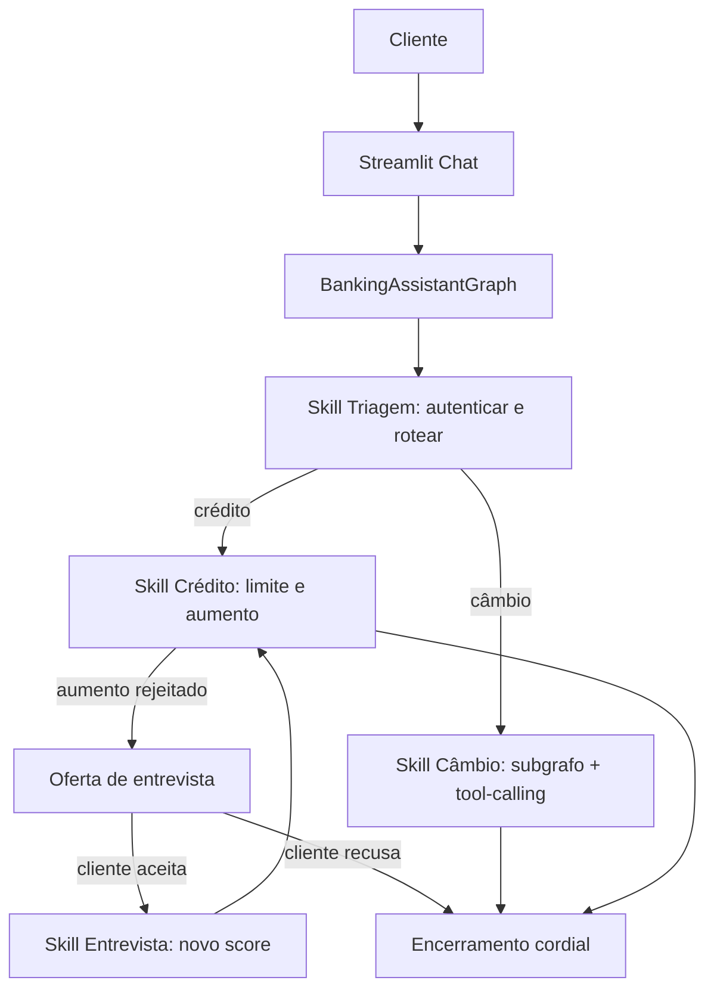
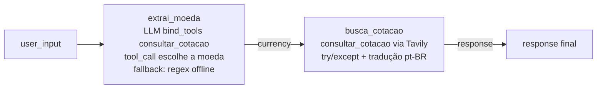

# Desafio Agentes IA Banco Ágil

[](https://www.python.org/)
[](https://www.langchain.com/langgraph)
[](https://www.langchain.com/langsmith)
[](https://streamlit.io/)
[](#tutorial-de-execução-e-testes)

**Tags:** `langgraph` `langsmith` `openrouter` `deepseek` `streamlit` `tavily` `tool-calling` `ai-agents` `sdd` `evals`

> Enunciado original: [`docs/challenge/desafio-tecnico-agentes-ia-bianca.pdf`](docs/challenge/desafio-tecnico-agentes-ia-bianca.pdf)

## Sumário

- [Visão Geral](#visão-geral)
- [Arquitetura do Sistema](#arquitetura-do-sistema)
- [Funcionalidades Implementadas](#funcionalidades-implementadas)
- [Observabilidade e Evals](#observabilidade-e-evals)
- [Estrutura do Projeto](#estrutura-do-projeto)
- [Desafios Enfrentados e Como Foram Resolvidos](#desafios-enfrentados-e-como-foram-resolvidos)
- [Escolhas Técnicas e Justificativas](#escolhas-técnicas-e-justificativas)
- [Tutorial de Execução e Testes](#tutorial-de-execução-e-testes)

## Visão Geral

Atendimento bancário inteligente para o **Banco Ágil**, um banco digital fictício. O desafio descreve quatro agentes especializados (Triagem, Crédito, Entrevista de Crédito e Câmbio), mas também exige que as transições entre eles sejam **implícitas**, de modo que o cliente sinta que conversa com um único atendente com habilidades diferentes.

Por isso a solução usa um único `BankingAssistantGraph` em **LangGraph**, no qual cada "agente" do enunciado vira uma *skill* (nó) interna do grafo, com estado compartilhado. O LLM (**DeepSeek via OpenRouter**) entende a linguagem natural e a transcreve para dados estruturados; o **Python aplica as regras bancárias** de forma determinística e auditável. As decisões sensíveis (autenticação, score, aprovação de limite, escrita em CSV) nunca são delegadas ao modelo.

## Arquitetura do Sistema

### Agentes do enunciado como skills

| Agente do desafio | Skill no grafo | Responsabilidade |
| --- | --- | --- |
| Triagem | `triage_node` | Saudação, coleta e validação de CPF/data, até três tentativas, roteamento por intenção |
| Crédito | `credit_node` | Consulta de limite, solicitação de aumento, registro em CSV e decisão por score |
| Entrevista de Crédito | `credit_interview_node` | Entrevista passo a passo, cálculo do novo score e atualização do cadastro |
| Câmbio | `exchange_node` → subgrafo `exchange_app` | Cotação em tempo real por *function tool* (Tavily), resposta em português e encerramento cordial |

### Fluxo principal



### O subgrafo de câmbio (tool-calling real)

O câmbio é o ponto onde o LLM **chama uma ferramenta de verdade**. Em vez de extrair a moeda por regex, o nó `exchange_node` invoca um subgrafo LangGraph dedicado ([src/exchange_subgraph.py](src/exchange_subgraph.py)), composto por dois passos:



- **`extrai_moeda`** vincula a tool [`consultar_cotacao`](src/tools/exchange.py) ao modelo com `bind_tools`; o LLM emite um `tool_call` informando a moeda em código ISO de 3 letras (ex.: `dólar → USD`, `euro → EUR`, `iene → JPY`). Sem `OPENROUTER_API_KEY` (ou se o modelo não emitir o `tool_call`), cai num **fallback determinístico** por palavras-chave/regex.
- **`busca_cotacao`** executa a tool `consultar_cotacao` (que envolve a Tavily) sob `try/except`, mantendo o tratamento de erro no Python. A resposta da Tavily — que costuma vir em inglês — passa por uma etapa de **tradução para pt-BR a temperatura 0**, com instrução explícita de **preservar os valores numéricos** (sem recalcular nem inventar).

Esse arranjo demonstra *tool-calling* nativo e *subgraph composition* sem abrir mão do determinismo: o LLM decide **qual** moeda; o Python decide **como** buscar e trata os erros.

### Camada de entendimento (LLM) versus regras (Python)

- O LLM classifica a intenção e extrai dados estruturados (valor de aumento, respostas da entrevista, consentimento, moeda) validados por modelos Pydantic em [src/schemas.py](src/schemas.py).
- Quando não há `OPENROUTER_API_KEY` ou ocorre falha técnica, há sempre um **fallback determinístico**, o que mantém o sistema funcional e testável offline.
- As decisões bancárias (autenticação, score, aprovação de limite, escrita em CSV) são 100% Python, auditáveis.

### Manipulação de dados

- [data/clientes.csv](data/clientes.csv): base de clientes (CPF, nome, nascimento, limite, score).
- [data/score_limite.csv](data/score_limite.csv): faixa de score para o limite máximo permitido.
- [data/solicitacoes_aumento_limite.csv](data/solicitacoes_aumento_limite.csv): registro formal das solicitações com `cpf_cliente`, `data_hora_solicitacao` (ISO 8601 com timezone), `limite_atual`, `novo_limite_solicitado`, `status_pedido`.

## Funcionalidades Implementadas

- Saudação inicial humanizada e coleta de CPF e data de nascimento.
- Autenticação contra `clientes.csv`, aceitando data em ISO (`AAAA-MM-DD`) e brasileiro (`DD/MM/AAAA` ou `DD-MM-AAAA`).
- Até três tentativas de autenticação e encerramento cordial após a terceira falha.
- Triagem de intenção após a autenticação, conduzida pelo LLM com saída estruturada e fallback por palavras-chave.
- Consulta de limite de crédito.
- Solicitação de aumento com extração do valor pelo LLM ("cinco mil", "5k", "8 mil") e registro em CSV.
- Aprovação ou rejeição por score via `score_limite.csv`.
- Oferta de entrevista de crédito quando o aumento é rejeitado, conduzida apenas se o cliente aceitar.
- Entrevista passo a passo (renda, emprego, despesas, dependentes, dívidas) com cálculo de novo score (0 a 1000) e atualização do cadastro.
- **Câmbio com *function tool*:** o LLM aciona a tool `consultar_cotacao` para consultar **qualquer moeda** em tempo real via Tavily; a resposta é entregue em **português** e o tópico encerra de forma amigável.
- Encerramento do atendimento a qualquer momento.
- Tratamento de erros controlado (CSV ausente, API indisponível, entrada inválida) com log técnico, sem interromper a conversa abruptamente.
- Memória de fluxo (`active_flow`) para continuar follow-ups sem reclassificar do zero.
- UI em Streamlit, observabilidade e eval offline com LangSmith.

## Observabilidade e Evals

LangSmith é usado de forma enxuta, focado no que mais importa para um sistema *agentic*:

- [src/observability.py](src/observability.py) registra um resumo sanitizado de cada turno; CPFs são mascarados antes de ir para o trace.
- [evals/datasets/intent_cases.jsonl](evals/datasets/intent_cases.jsonl) contém casos de classificação de intenção.
- [evals/run_intent_eval.py](evals/run_intent_eval.py) cria/reusa o dataset no LangSmith e roda a métrica `intent_accuracy`.

## Estrutura do Projeto

```text
.
├── app.py                       # UI Streamlit (loop de atendimento)
├── data/
│   ├── clientes.csv
│   ├── score_limite.csv
│   └── solicitacoes_aumento_limite.csv
├── docs/
│   └── challenge/
│       └── desafio-tecnico-agentes-ia-bianca.pdf
├── evals/
│   ├── datasets/
│   │   └── intent_cases.jsonl
│   └── run_intent_eval.py
├── src/
│   ├── graph.py                 # grafo principal: triagem, crédito, entrevista, câmbio
│   ├── exchange_subgraph.py     # subgrafo de câmbio (tool-calling + Tavily + pt-BR)
│   ├── conversation.py          # respostas humanizadas e normalização para a UI
│   ├── llm.py                   # client OpenRouter/DeepSeek (com cache e gate opcional)
│   ├── observability.py         # tracing e mascaramento de CPF
│   ├── schemas.py               # modelos Pydantic da saída do LLM
│   ├── state.py                 # AgentState (TypedDict)
│   └── tools/
│       ├── auth.py              # autenticação contra o CSV
│       ├── credit.py            # limite, decisão por score e registro
│       ├── exchange.py          # Tavily + @tool consultar_cotacao
│       └── scoring.py           # cálculo e atualização de score
├── tests/                       # 61 testes (pytest), rodam offline
└── .specs/                      # especificação, design e tarefas (SDD)
```

## Desafios Enfrentados e Como Foram Resolvidos

- **Transição implícita entre agentes:** o desafio pede agentes especializados, mas sem que o cliente perceba a troca. Resolvido modelando os agentes como skills de um único grafo LangGraph, com estado compartilhado.
- **Entendimento de linguagem natural:** valores como "cinco mil" não eram capturados por regex, e a entrevista travava. Passamos a extração para o LLM com schemas Pydantic, deixando o regex apenas como fallback.
- **Memória de atendimento:** o agente reclassificava a intenção a cada turno e perdia o contexto. Adicionamos um estado de fluxo ativo (`active_flow`) que mantém a conversa no trilho (aumento, oferta de entrevista, entrevista) até concluir ou o cliente encerrar.
- **Re-submissão duplicada de aumento (integridade de dados):** o `requested_limit` permanecia no estado e, após uma aprovação, uma simples consulta de limite re-disparava a gravação no CSV (linha duplicada). Corrigido movendo a submissão para **dentro do ramo de aumento**, exigindo intenção de aumento no turno atual; coberto por teste de regressão.
- **Tool-calling de verdade no câmbio:** o enunciado sugere "utilizar ferramentas apropriadas". Evoluímos o câmbio de extração por regex para uma *function tool* (`@tool consultar_cotacao` + `bind_tools`), em que o próprio LLM decide a moeda, com a Tavily determinística por baixo e fallback regex offline.
- **Resposta do câmbio em português:** a Tavily retorna o texto em inglês. Adicionamos uma etapa de tradução para pt-BR a temperatura 0, instruindo o modelo a preservar exatamente os valores numéricos, sem recalcular nem inventar.
- **Renderização no Streamlit:** o `R$` quebrava a tela porque o `$` era interpretado como fórmula LaTeX. Passamos a escapar o cifrão em todas as mensagens exibidas.
- **Decisões auditáveis:** mantivemos score, aprovação e CSV em Python determinístico, sem delegar regra de negócio ao LLM.

## Escolhas Técnicas e Justificativas

- **LangGraph**: orquestra o atendimento como grafo de estados, com rotas explícitas e transição implícita entre skills; o câmbio é um **subgrafo composto** (`extrai_moeda → busca_cotacao`).
- **Function tool + `bind_tools` (tool-calling)**: o câmbio usa a tool `consultar_cotacao`; o LLM emite o `tool_call` escolhendo a moeda, enquanto a regra (Tavily) permanece determinística no Python.
- **OpenRouter + DeepSeek**: LLM como camada de entendimento e extração estruturada (JSON validado por Pydantic), configurável por `.env`.
- **`optional_chat_model`**: gate único que devolve o client quando há `OPENROUTER_API_KEY` e `None` caso contrário, permitindo o fallback determinístico e a execução offline em testes.
- **Pydantic schemas**: `IntentResult`, `LimitIncreaseRequest` e `CreditInterviewAnswers` garantem que a saída do LLM vire dado confiável.
- **Memória de fluxo (`active_flow`)**: preserva o contexto imediato do atendimento para continuar follow-ups sem depender só da última frase.
- **Cache do client LLM**: reutiliza o client por modelo e temperatura para reduzir latência.
- **Tavily**: cotações de moedas em tempo real.
- **LangSmith**: tracing e eval offline sem MLOps pesado.
- **CSV**: persistência simples e auditável, aderente ao enunciado.
- **SDD + TDD**: requisitos, design e tarefas em [.specs/](.specs/) e suíte de testes guiando a implementação.

## Tutorial de Execução e Testes

Crie um arquivo `.env` baseado em [.env.example](.env.example):

```bash
OPENROUTER_API_KEY=sua_key_openrouter
OPENROUTER_MODEL=deepseek/deepseek-v4-flash
TAVILY_API_KEY=sua_key_tavily
LANGSMITH_TRACING=true
LANGSMITH_ENDPOINT=https://api.smith.langchain.com
LANGSMITH_API_KEY=sua_key_langsmith
LANGSMITH_PROJECT=desafio-agentes-ia-banco-agil
```

> Sem as chaves o sistema continua funcionando via fallback determinístico (e toda a suíte de testes roda offline). As chaves habilitam a classificação por LLM, o tool-calling do câmbio e o tracing no LangSmith.

Instale as dependências:

```bash
python -m pip install -e ".[dev]"
```

Rode a interface:

```bash
streamlit run app.py
```

Rode a eval de intenção no LangSmith:

```bash
python -m evals.run_intent_eval
```

Rode os testes:

```bash
python -m pytest
```

Rode os testes com cobertura:

```bash
python -m pytest --cov=src --cov-report=term-missing
```

Dados de teste para autenticação:

```text
CPF: 12345678900
Data de nascimento: 10/05/1990
```

Também são aceitos `1990-05-10` e `10-05-1990`.

Exemplos de mensagens:

```text
Meu CPF é 12345678900 e nasci em 10/05/1990
Quero consultar meu limite
Quero aumentar para cinco mil
Qual a cotação do dólar hoje?
Quanto está o euro?
Encerrar
```
